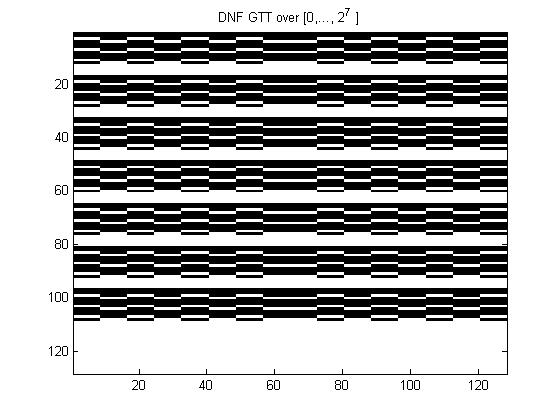

# SATbox: A toolbox for exploring fractality in satisfiability (SAT) problems

Full explanations for the methods used are given in a submitted publication of which a preprint is available in this link 
http://vixra.org/abs/1707.0074 [PDF]

The core eval function uses a purely functional approach with a universal indicator function over any search interval.

The hierarchical classification used here is described in the below table

| Expression Type| Clauses       | Overlaps      |Satisfiability |
| -------------  | ------------- | ------------- | ------------- |
| SAT0           | Equal         | No            | Complete      |
| SAT1           | Unequal       | No            | Complete      |
| SAT2           | Equal         | Yes           | Partial       |        
| SAT3           | Unequal       | Yes           | Partial       |

When the total clause length and the overlap arithmetized codes are taken over an inclusive hierarchy of exponential intervals
complete enumeration of all such expressions over each level becomes possible with the aid of 
<a href="http://mathworld.wolfram.com/PartitionFunctionP.html">Integer Partition</a> and Restricted Integer Partition functions.

Partial satisfiability criterion depends only on the structure of a connectivity matrix in an assignment map from atoms to literals. 

Global Truth Tables (GTTs) are defined as symmetric matrices for all possible assignments of atoms to literals ('Negation Codes') where 'X' axis holds all possible combinations of atom variables and 'Y' axis (Top-Down:) holds all possible negation codes.

INPUT FILE FORMAT: Each and every clause occupies a single row. For every clause only the indices of atom variables are denoted
and any negation operator in front of a variable is given as a minus sign. In case of a GTT computation this is ignored since all possible negations will be tried by the program. Hence, an expression like (X1 \/ X3) /\ ( NOT(X2) \/ X4) /\ (X2 \/ NOT(X3) \/ X5) will be denoted as

1  3

-2 4

2 -3 5

USAGE: Main interface is provided by the sat.m routine which reads input files, performs the appropriate encodings for the arithmetization of the incoming expression and calls all other eval routines. At the moment there are only two options as
two separate flags, one for choosing to evaluate a single negation code (0) or a GTT (1) and a second one for choosing an evaluation method between the standard indicator function approach (0) and the Sequential Dynamical System (1) approach. In the 2nd case, first flag is ignored as only a single expression is evaluated each time. To use first cd SATbox/ then use addpaths to
put SATutilities and SATSDS folders in your path and use sat( 'filename', flag1, flag2 ). Filename should not contain extensions (".txt") For flag1 = 0, the program offers the complete block analysis of any resulting binary sequence of total length 2^L where L is the summand of the separate clauses populations. Flags can be omitted where sat('fname') is equivalent to flag1 = 0, and sat('fname', f1) is equivalent to flag2 = 0. For the example files offered it should obtain as below (eg,  sat('sat0', 1);). 

SAT0:

   

SAT1:

   

SAT2-2: (from https://en.wikipedia.org/wiki/Maximum_satisfiability_problem)

   

SAT3:

   

