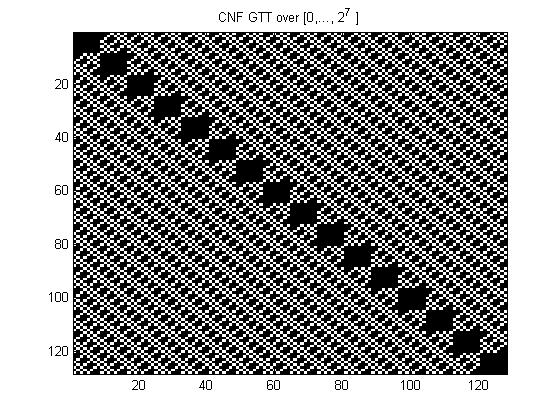
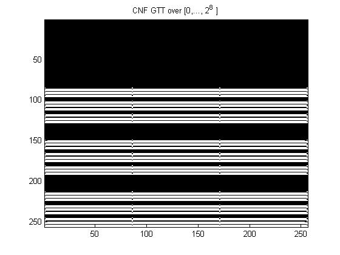

# SATbox: A toolbox for exploring fractality in satisfiability (SAT) problems

(The full methodology shall be explained in a forthcoming publication.)

The core eval function uses a purely functional approach with a universal indicator function over any search interval.

The hierarchical classification used here is described in the below table

| Expression Type| Clauses       | Overlaps      |Satisfiability |
| -------------  | ------------- | ------------- | ------------- |
| SAT0           | Equal         | No            | Complete      |
| SAT1           | Unequal       | No            | Complete      |
| SAT2           | Equal         | Yes           | Partial       |        
| SAT3           | Unequal       | Yes           | Partial       |

When the total clause length and the overlap arithmetized codes are taken over an inclusive hierarchy of exponential intervals
complete enumeration of all such expressions over each level becomes possible with the aid of 
<a href="http://mathworld.wolfram.com/PartitionFunctionP.html">Integer Partition</a> and Restricted Integer Partition functions.

Partial satisfiability criterion depends only on the structure of a connectivity matrix in an assignment map from atoms to literals. 

Global Truth Tables are defined as symmetric matrices for all possible assignments of atoms to literals ('Negation Codes')

For the example files they should obtain as below

SAT0:

   

SAT1:

   

SAT2-2: (from <a href="https://en.wikipedia.org/wiki/Maximum_satisfiability_problem">Wikipedia<\a>)

   

SAT3:

   

